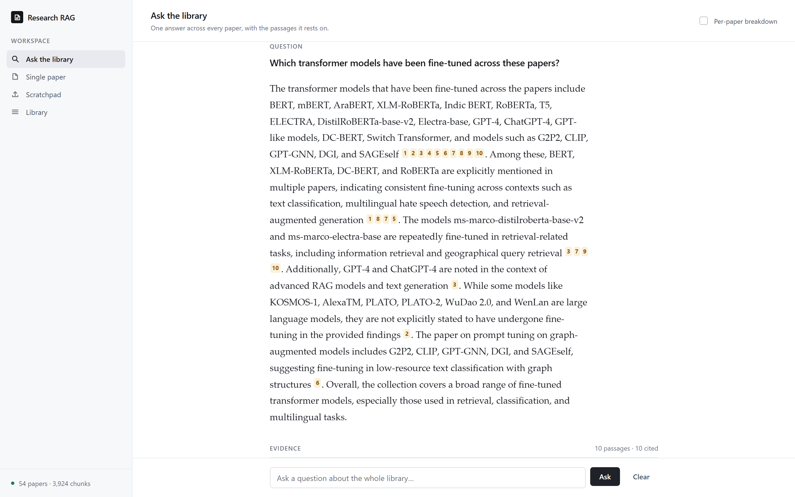
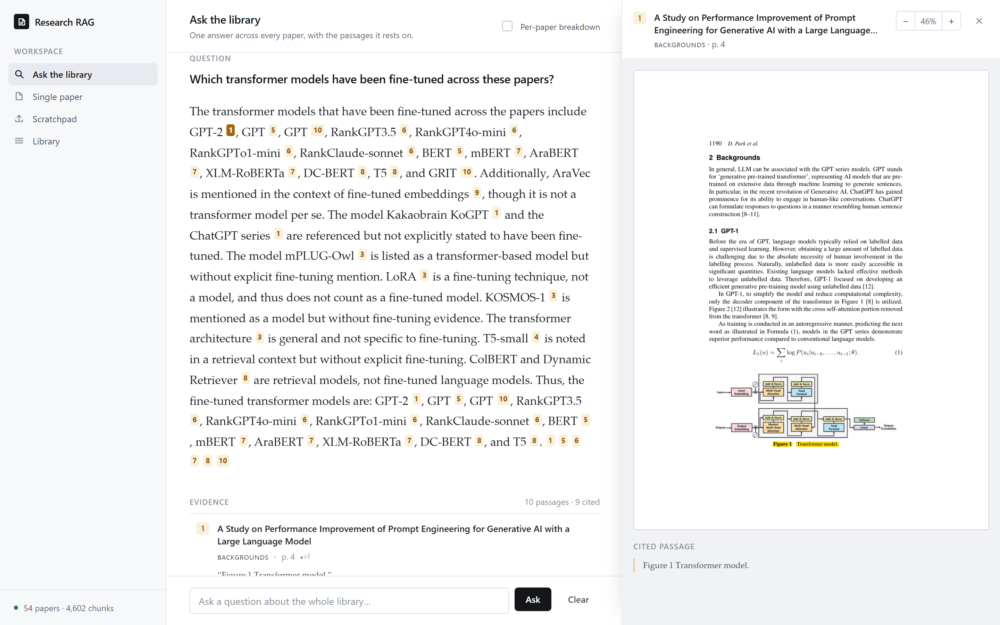
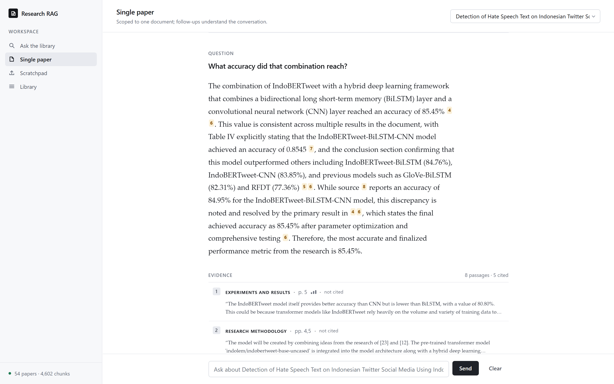

# Research RAG

**Section-aware retrieval-augmented generation over research papers, fully offline.**

Drop a folder of PDFs in, ask questions in natural language, and get answers grounded
in specific sections of specific papers, with the source passage rendered back on the
original PDF page. No API keys and no cloud calls: parsing, embedding, reranking and
generation all run locally.

```
"What datasets were used for Arabic offensive language detection?"

  -> routed as a question that needs several papers at once
  -> shortlisted to the papers whose cards mention Arabic
  -> searched inside each one's data sections, not across the whole corpus
  -> reranked, then written as one answer whose every claim carries a [n]
     citation back to the passage it came from
```

There are four views on top of that: one synthesized answer across the library, a chat
scoped to a single paper, a drop-in upload that never touches the library, and a
browsable list of what has been ingested.



Every `[n]` is clickable. Opening one renders that exact passage on its original
PDF page, highlighted, so you can check a claim against the paper in one click
instead of taking it on trust:



The single-paper view keeps a conversation scoped to one document and resolves
follow-ups against what came before. Here *"that combination"* becomes the
IndoBERTweet-BiLSTM-CNN model from the previous turn:



---

## Why this is not another naive RAG demo

Most RAG-over-PDF projects flatten a document into fixed-size chunks and hope cosine
similarity finds the right one. Research papers have structure worth keeping, and the
design here is built around exploiting it.

| Problem with naive RAG | What this project does |
| --- | --- |
| Fixed-size chunks split tables and paragraphs mid-thought | [Docling](https://github.com/DS4SD/docling) parses layout and a `HierarchicalChunker` splits on real document structure |
| Chunks lose their place in the document | Every chunk stores its `section_name`, `subsection_name` and page numbers |
| "What was the methodology?" retrieves the abstract, which only *mentions* methodology | Queries are classified to a section type, then search is **restricted** to matching sections |
| Papers number sections inconsistently (`3.1`, `A.`, `III.`) | Numbering is auto-detected per paper (decimal, IEEE or alphabetic) and orphaned subsections are re-parented |
| References and ethics statements pollute results | Boilerplate sections are dropped at ingest via a blacklist and a title check |
| Top-k vector hits are often loosely relevant | A cross-encoder reranks 4x the candidates down to the best `k` |
| Answers are hard to trust | Each answer links to the exact passage, rendered onto its original PDF page |
| Section vocabulary is field-specific: `corpus`, `cohort`, `specimen` and `primary sources` all mean *the data* | Classification is by section **function**, using vocabulary from nine disciplines, and it refuses to guess on words that flip meaning between fields |

---

## Quickstart

### Prerequisites

- **Python 3.11+**
- **Docker**, which runs the Weaviate vector database
- **[Ollama](https://ollama.com)**, which runs the local LLM

```bash
ollama pull qwen3:4b-instruct   # ~2.5 GB; see "Choosing a model" above
```

### Install

```bash
git clone https://github.com/saleemb94/Research-RAG.git
cd Research-RAG

python -m venv .venv
source .venv/bin/activate     # Windows: .venv\Scripts\activate
pip install -r requirements.txt
```

### Start the vector database

```bash
docker compose up -d
```

Weaviate is published on **8081** (REST) and **50052** (gRPC) rather than the usual
8080/50051, so it does not collide with another Weaviate you may already be running.
Override with `WEAVIATE_PORT` and `WEAVIATE_GRPC_PORT` in a `.env` file; `docker
compose` and the app both read them.

Check it is healthy:

```bash
docker compose ps             # should show "healthy"
curl http://localhost:8081/v1/.well-known/ready
```

### Ingest papers and ask questions

```bash
mkdir -p papers && cp /path/to/*.pdf papers/

python -m research_rag.cli ingest papers/     # also builds cards + section index
python -m research_rag.cli list
python -m research_rag.cli sections --paper mypaper.pdf
python -m research_rag.cli search "What datasets were used?"
```

### Or use the web UI

```bash
python app.py                 # opens http://localhost:7860
```

On Windows there is a launcher that does the whole startup in one step: it starts
Docker Desktop if it is not running, brings up Weaviate, waits for both it and Ollama
to actually answer, then starts the app and opens the browser.

```powershell
powershell -ExecutionPolicy Bypass -File scripts\launch.ps1
```

To put it on the desktop, make a shortcut to that command with
[`docs/icon.ico`](docs/icon.ico) as its icon (regenerate the icon with
`python scripts/make_icon.py`). Closing the window stops the app; Weaviate keeps
running until `docker compose down`.

Four views:

| View | What it does |
| --- | --- |
| **Ask the library** | One synthesized answer across every paper, each claim carrying a `[n]` citation you can open |
| **Single paper** | A conversation scoped to one document, with follow-ups resolved against the history |
| **Scratchpad** | Drop in a PDF, ask about it, discard it. Stored separately and never visible to the other views |
| **Library** | What is ingested: filter by title, select any number of papers to remove at once, progress reported for both adding and removing |

Clicking any citation opens the source panel and renders that passage on its original
PDF page, highlighted.

### Interface

One file, no build step, no CDN. [`static/index.html`](static/index.html) carries its
own design tokens. That last part is deliberate: a page fetching a stylesheet and two
font files on every load would quietly contradict the offline claim above, so the type
is a system stack and the CSS is local.

Two color roles do the work. Neutral ink handles text, borders, surfaces and the
primary action, since contrast is what marks a button primary, and that leaves color
free to mean something. A single amber means exactly one thing: **evidence**. Citation
markers, the open source, retrieved passages. It is the hue the PDF renderer highlights
with, so a citation and the highlight it points at read as the same object. Amber
therefore never signals a warning here; failures use the semantic red.

The answer is set in a serif at roughly a 68-character measure, because it is the one
place the product shows sustained prose and it should read as a document rather than a
message. Its evidence sits below it and subordinate to it, as rows rather than cards,
each carrying the passage text inline. So *what did it conclude*, then *on what*, then
*show me the page*, in that order, with the last step only if you want it. Every
passage shows its section, its page, and a coarse three-step read of the retrieval
distance, omitted rather than invented for the channels that report no distance.

---

## Architecture

```
        PDF
         │
         ▼
   ┌──────────────┐   layout-aware parsing + hierarchical chunking
   │   Docling    │
   └──────┬───────┘
          │  chunks + headings
          ▼
   ┌──────────────────────────────────┐   3-stage section classification:
   │      Section classifier          │   1. keyword match
   │  (keywords -> LLM -> content)    │   2. LLM batch classify ambiguous
   └──────┬───────────────────────────┘   3. verify against first paragraph
          │  section_name / section_type / pages
          ▼
   ┌──────────────┐   BAAI/bge-small-en-v1.5, 384-dim, normalized
   │   Embedder   │   embedded with the paper title and section as context
   └──────┬───────┘
          │  vectors + metadata
          ▼
   ┌──────────────────────────────────┐
   │   Weaviate  (Docker container)   │   HNSW, cosine, self-provided vectors
   └──────┬───────────────────────────┘   exact-match filters on section fields
          │
          ├──► one summary per section, embedded ──► second retrieval channel
          └──► one structured card per paper ──────► corpus-level questions
          │
          ▼  ── query path ──────────────────────────────────────────────
   ┌──────────────────────────────────┐   corpus    -> answer from the cards
   │        Question router           │   enumerate -> fan out over papers
   └───┬──────────────┬───────────┬───┘   focused   -> ordinary retrieval
       │              │           │
       │              │           ▼
       │              │    ┌──────────────┐  classify query, match to stored
       │              │    │ Hierarchical │  headings, filter, search within
       │              │    │  retrieval   │  section, global fallback
       │              │    └──────┬───────┘
       │              │           │   three channels, unioned:
       │              │           │   chunk vectors · section summaries · BM25
       │              │           ▼
       │              │    ┌──────────────┐  cross-encoder/ms-marco-MiniLM-L-6-v2
       │              │    │   Reranker   │
       │              │    └──────┬───────┘
       ▼              ▼           ▼
   ┌──────────────────────────────────┐   one answer, every claim carrying a
   │   Ollama   (qwen3:4b-instruct)   │   marker, validated against the
   └──────┬───────────────────────────┘   passages actually retrieved
          ▼
   FastAPI + web UI, with PyMuPDF rendering the source page
```

### Three ways a question gets answered

Not every question needs the same machinery. A router classifies each question first,
and the three paths differ in what they read, not just in how long they take.

**Corpus.** *"Which papers use transformers?"*, *"what languages are covered?"* These
are questions about the shape of the library rather than the contents of any one paper.
Retrieval is the wrong tool: the answer is a property of every paper at once, and the
top 5 chunks can only ever see a few of them. So they are answered from the structured
card built for each paper at ingest, which means every paper gets considered.

**Enumerate.** *"What datasets were used across these papers?"* The answer is a list
assembled from many papers, each contributing a piece. The question fans out: shortlist
the papers worth reading, search each one separately, extract just the relevant finding
from each, then reduce those findings into a single cited answer. Searching once across
the corpus would return five chunks from the two papers that phrase things most
similarly and silently miss the rest.

**Focused.** *"What accuracy did IndoBERTweet reach?"* One fact, in one place. Ordinary
retrieval: classify the query to a section type, filter, search, rerank, answer.

The single-paper view skips the router. The paper is already chosen, so there is
nothing to route.

### Retrieval safety rails

Section filtering is enforced in three independent places, because an LLM classifier
on its own is not trustworthy enough to silently drop content:

1. **Cross-validation at match time.** A heading the LLM matched is discarded if its
   dominant ingest-time `section_type` contradicts the query's target type.
2. **Database-level filter.** Weaviate filters on `section_name` with `FIELD`
   tokenization, so `"Data Collection"` matches that heading exactly and never a
   section that merely contains the word *Data*.
3. **Post-retrieval filter in Python.** Hits are re-checked against the allowed set
   regardless of what the database returned.

If a section turns out to be empty, retrieval falls back to a global search rather
than returning nothing, and the filters in step 3 are **switched off on that fallback
path**. That detail matters. Applying an allow-list for a section the paper does not
have deletes every fallback hit and returns an empty answer while the store is holding
perfectly good chunks. It shipped that way until the golden question set caught it, and
`tests/test_retrieval_filters.py` now pins it.

**Scope decides how sections are matched.** Inside one paper, the target is matched
onto that paper's real headings, so "methodology" finds a section actually called
"Our Approach". Across the corpus that would be wrong: heading lists get pooled, the
model picks names that exist in only one or two papers, and filtering on them makes
every other paper unreachable. A corpus-wide query filters on `section_type` instead,
which is assigned per chunk at ingest precisely so that it generalizes.

### Working across disciplines

Papers are not all from one field, so the classifier is built around section
**function** rather than any single field's vocabulary.

The eight labels (`abstract`, `introduction`, `theory`, `related_work`, `methodology`,
`dataset`, `results`, `conclusion`) describe roles that recur across empirical research
whatever the subject. `theory` covers papers that are not empirical at all: theorems
and proofs in mathematics, derivations in physics, formal models in economics,
conceptual frameworks in the social sciences.

Each label carries vocabulary from several fields, because the same role is named
differently everywhere:

| Role | Computing | Medicine | Social science | Humanities |
| --- | --- | --- | --- | --- |
| `dataset` | corpus, benchmark, training set | cohort, study population, inclusion criteria | participants, respondents, sample | primary sources, archival material |
| `methodology` | proposed method, architecture | trial protocol, randomization, assay | interview protocol, coding procedure | fieldwork, ethnography |
| `related_work` | related work, prior art | systematic review, meta-analysis | literature review | historiography |

**Where it deliberately refuses to guess.** Some headings mean different things in
different fields, and a confident wrong answer from the fast keyword stage would stop
the later stages ever reading the section's text. Those headings are listed in
`_DEFER_TO_CONTENT` and returned as unclassified on purpose, which routes them to the
LLM stages that can actually read the content:

| Heading | In computing | In another field |
| --- | --- | --- |
| "Statistical Analysis" | reported findings | the analysis plan, inside Methods (medicine) |
| "Survey" | a literature survey | a questionnaire instrument (sociology) |
| "Materials" | (rare) | reagents (chemistry), stimuli (psychology), or half of "Materials and Methods" |
| "Model" | an implemented system | a formal model (economics, theory) |
| "Baseline Characteristics" | a comparison result | a description of the participants (clinical trials) |

That last one used to be classified as a *result*, which is simply wrong for a clinical
paper. It describes who was enrolled.

### Choosing a model

The summarization step is forgiving. Most instruct models write something reasonable
from retrieved text. The *routing* steps are not: they decide which sections get
searched at all, so an error there silently changes the answer without looking like a
failure. `scripts/eval_models.py` scores exactly those three call sites against ground
truth spanning nine disciplines:

```bash
python scripts/eval_models.py                      # every installed model
python scripts/eval_models.py qwen3:8b --think     # measure reasoning mode
python scripts/eval_models.py -v qwen2.5:7b        # show every wrong answer
```

Measured on an RTX 5060 Laptop (8 GB), 50 graded items:

| Model | Headings | Query | Target | Overall | Time |
| --- | --- | --- | --- | --- | --- |
| **qwen3:4b-instruct** (default) | 96% | 100% | 100% | **98%** | **5.5 s** |
| qwen3:8b (reasoning off) | 92% | 100% | 100% | 96% | 9.0 s |
| qwen2.5:7b | 88% | 95% | 100% | 92% | 10.9 s |
| qwen3:8b (reasoning on) | 92% | 90% | 100% | 92% | 133.5 s |
| llama3.2:3b | 33% | 90% | 83% | 62% | 10.1 s |

Three results worth knowing:

- **Bigger was not better.** `qwen3:4b-instruct` beat `qwen3:8b` on accuracy and was
  faster. These tasks reward instruction-following on a fixed label set, not knowledge.
- **Reasoning actively hurt.** With thinking enabled, `qwen3:8b` took 15x longer and
  scored lower (92% against 96%). It deliberates its way out of correct one-word
  answers, spending around 715 tokens where 2 would do. Reasoning is off by default for
  that reason; set `OLLAMA_THINK=true` to override.
- **Heading classification is where models separate.** Every model handles query
  routing well. Only the good ones classify unfamiliar headings like "Baseline
  Characteristics" or "Historiography" correctly, and that step runs at ingest, so
  every later retrieval inherits its mistakes.

Note that the 2507 "Instruct" (non-thinking) refresh only exists for 4B, 30B-A3B and
235B. There is no `qwen3:8b-instruct`, so at 8B you get the hybrid model and have to
disable reasoning explicitly. Ollama returns reasoning in a separate `thinking` field,
so it never corrupts parsed output; the cost is latency, not correctness.

All Ollama traffic goes through [`research_rag/llm.py`](research_rag/llm.py), which
applies this policy in one place.

### Evaluation

Quality is measured, not asserted. A RAG system can fail in several independent places
and one end-to-end number hides which one broke, so each is scored separately against
hand-built golden sets: 138 graded questions over 341 fact groups in
`tests/golden_qa.json`, plus 40 questions with 93 labeled gold passages in
`tests/golden_passages.json`.

```bash
python scripts/eval_rag.py --coverage      # is the fact in the index at all? (no LLM)
python scripts/eval_rag.py --retrieval     # asked blind, does the right paper come back?
python scripts/eval_rag.py --passages      # Recall@k, MRR, MAP, nDCG over gold passages
python scripts/eval_rag.py --generation    # given the right paper, is the fact stated?
python scripts/eval_rag.py --synthesis     # corpus-wide cited answers
python scripts/eval_rag.py --thematic      # discussion questions across a topic
python scripts/eval_rag.py --all -v
```

| | baseline | now | |
| --- | --- | --- | --- |
| Coverage, fact is in the index | 100% | **100%** | 229/229 |
| Retrieval, right paper returned | 67% | **70%** | 75/107 |
| Retrieval, right paper ranked first | 51% | **53%** | 57/107 |
| Generation, fact stated in the answer | 71% | 69% | 158/229 |
| Synthesis, facts stated in one cited answer | 73% | **76%** | 25/33 |
| Synthesis, expected papers actually cited | 56% | **70%** | 30/43 |
| Thematic, facts stated in a discussion answer | | 67% | 53/79, mean of 5 |
| Thematic, questions meeting the breadth bar | | 48% | 7.6/16, mean of 5 |
| Negative controls, correctly declined | 100% | **100%** | 5/5 |
| Invalid citations emitted | 0 | **0** | |

Passage-level retrieval, scored against the gold passages at k=10:

| | |
| --- | --- |
| Recall@10 | 0.709 |
| MRR@10 | 0.771 |
| MAP@10 | 0.595 |
| nDCG@10 | 0.672 |

Those four are exact rather than averaged, because retrieval is reproducible: three
consecutive runs return identical numbers. That is deliberate and was not always true.
The model ships at `temperature 0.7` and nothing overrode it, so the router that chooses
between answering from paper cards, fanning out over papers, and ordinary retrieval was
*sampling* its decision. The same question took different paths on different runs, which
is not variance in the answer but variance in what produced it. Steps that pick a label
or a path are now greedy; the step that writes prose is not, because that is a choice
rather than a decision with one right answer.

Two principles hold the sets together. Every fact was read **from the source PDF, never
from the search index**, and gold passages were labeled **by reading, never by running
the retriever**: a set built from what the system returns measures the system against
itself and can only score well. And gold passages are pinned by a verbatim text anchor
rather than a chunk id, so re-chunking the corpus cannot silently invalidate them.

**One worked example of why the numbers are the beginning of the analysis, not the end.**
*How do these papers evaluate retrieval and generation quality?* scores 1 of 5 fact
groups on every run, which reads unambiguously as a retrieval defect. It is not one. The
answer is substantive: perplexity differences between original and RAG-prompt responses,
a DCG@k estimate of what the top-k passages contribute, the eRAG method of scoring each
retrieved document by downstream task performance, faithfulness and context relevance.
It simply never writes the strings `nDCG`, `MRR` or `ROUGE`. The question asks *how*
these papers evaluate, which invites methodology, and the fact groups then demanded
metric names. The answer was marked wrong for obeying the question.

Fixing that was worth more than the quality it bought, which was roughly none: recall
moved -0.003 and nDCG -0.002, both inside the old spread. What it bought was the ability
to tell a real change from noise at all. Several conclusions in this project turned on
differences of two or three points, and a sampling router made those differences
unfalsifiable without running everything three times.

That pattern recurred often enough to be worth stating as a result in its own right. Of
the three consistently weak thematic questions, two turned out to be flaws in the set.
A gap in passage recall that looked like retrieval giving up early turned out to be a
deliberate per-paper cap. Substring scoring cannot credit a correct paraphrase, so every
number above is a floor rather than an estimate. **A metric shows where to look; it does
not say what is true.** Reading the answers is what settles it, and it is the step that
found every real defect here.

Full methodology, the reasoning behind each set, benchmarks per pipeline stage, and the
measured negative results are in **[docs/evaluation.md](docs/evaluation.md)**.

### Running the tests

Classification is covered by tests that need neither Ollama nor Weaviate, so they run
in milliseconds:

```bash
python tests/test_section_classifier.py     # standalone
pytest tests/                               # or with pytest installed
python tests/test_ui.py                     # browser checks, needs Playwright
python tests/test_ui.py --headed            # watch it drive the browser
```

The browser tests start the real app on a spare port and drive the shipped page: a
citation has to render as a clickable chip, clicking it has to open the source panel
and actually paint the PDF page, tabs have to show exactly one view, model output must
never become markup, and the console has to stay clean. None of that is reachable from
an HTTP client, and the answer renderer has been rewritten twice.

They were checked against deliberate breakage rather than trusted for passing: renaming
the chip class makes "citations render as chips" fail on its own, and disabling the tab
handler fails all four tab checks.

The classification tests assert correct labels for headings drawn from computing,
medicine, psychology, chemistry, physics, mathematics, economics, law and history, and
pin the two distinctions the retrieval design depends on: background is not related
work, and ambiguous headings have to defer rather than guess.

---

## Configuration

Every setting is an environment variable with a sensible default. See
[`.env.example`](.env.example) and copy it to `.env` to override:

```bash
cp .env.example .env
```

| Variable | Default | Purpose |
| --- | --- | --- |
| `WEAVIATE_HOST` / `WEAVIATE_PORT` / `WEAVIATE_GRPC_PORT` | `localhost` / `8081` / `50052` | Where the database lives |
| `WEAVIATE_COLLECTION` | `ResearchChunk` | Collection name |
| `OLLAMA_MODEL` | `qwen3:4b-instruct` | Generation and classification model |
| `OLLAMA_THINK` | `false` | Let hybrid models reason first (slower, less accurate here) |
| `EMBEDDING_MODEL` | `BAAI/bge-small-en-v1.5` | 384-dim sentence embeddings |
| `RERANKER_MODEL` | `cross-encoder/ms-marco-MiniLM-L-6-v2` | Cross-encoder reranker |
| `TOP_K` | `5` | Chunks passed to the LLM |
| `RERANK_FETCH_MULTIPLIER` | `4` | Candidates fetched per final chunk |
| `HYBRID_ALPHA` | `0.3` | Hybrid weight: 0 is pure BM25, 1 is pure vector |
| `PAPER_PREFILTER_N` | `0` | Two-stage retrieval width; 0 searches every chunk flat |
| `APP_HOST` / `APP_PORT` | `127.0.0.1` / `7860` | Web app bind address |

Changing `EMBEDDING_MODEL` changes the vector dimension, so wipe and re-ingest
(`docker compose down -v`) when you do.

**Three settings that were measured rather than chosen.** `HYBRID_ALPHA` between 0 and
0.5 is indistinguishable on the golden set and quality falls above that, so 0.3 stays;
vector-only retrieval is five points worse, which is the sparse channel earning its
place on a corpus full of acronyms like SR-DPR, PLAML and CIRAL. `PAPER_PREFILTER_N`
turns on two-stage retrieval, ranking whole papers before searching chunks, and it is
off because on a library this size it loses: shortlisting to 20 of 54 papers took the
right paper from 95% to 90% and saved no time, since searching 3,900 chunks flat is
already milliseconds. It becomes the right trade when a flat scan costs real time,
which is a few hundred papers. The recall cost at each width is in `.env.example`.
`QUERY_INSTRUCTION` is empty for the same reason. bge is an asymmetric model, so
prefixing the query with BAAI's instruction is textbook usage, and here it took rank-1
accuracy from 0.708 to 0.649 over three runs each. Passages are not stored bare: each is
embedded with its title and section prepended, so instructing only the query pulls the
two sides of the space apart, and bge-en-v1.5 was retrained to retrieve well without it.
The setting stays because a different model needs it: e5 wants `query: `.

---

## Project layout

```
research_rag/
  config.py              env-driven settings, single source of truth
  ingest.py              Docling conversion, heading repair, boilerplate filtering
  section_classifier.py  3-stage heading classification and query/section matching
  embedder.py            sentence-transformers wrapper
  vector_store.py        Weaviate client: schema, writes, filtered vector search
  search.py              retrieval pipeline with the section safety rails
  synthesize.py          one cited answer, citation validation, follow-up rewriting
  map_reduce.py          exhaustive per-section scan, used by the single-paper view
  reranker.py            cross-encoder reranking
  enumerate_.py          fan-out over papers for "which X across these papers"
  paper_cards.py         one structured card per paper, for corpus-level questions
  section_index.py       section summaries as a searchable second retrieval channel
  titles.py              what a paper is called: metadata, then layout, then LLM
  chunk_rules.py         what counts as a usable chunk, and what a heading is
  context.py             embeds a chunk with its title and section as context
  prefilter.py           stage one of two-stage retrieval (off by default)
  llm.py                 single entry point for Ollama calls
  pdf_viewer.py          renders a chunk back onto its PDF page
  cli.py                 ingest / search / list / sections / delete
app.py                   FastAPI server and JSON API
static/index.html        the whole interface: markup, design tokens, behavior
scripts/
  eval_models.py                   score models on the routing tasks
  eval_rag.py                      score coverage / retrieval / generation / synthesis / thematic / passages
  eval_chat.py                     score the multi-turn and ad-hoc upload views
  fetch_arxiv.py                   pull open-access papers by pinned arXiv id
  build_paper_cards.py             backfill paper cards without re-parsing PDFs
  screenshots.py                   regenerate the README screenshots from the app
  bench.py                         stage timings and parsing quality
  backfill_titles.py               resolve paper titles without re-parsing
  repair_index.py                  fix parsing defects without re-parsing
  reembed_with_context.py          re-embed chunks with title and section
  sweep_retrieval.py               tune retrieval settings without the LLM
  launch.ps1                       one-step startup on Windows, for a shortcut
  make_icon.py                     draw docs/icon.ico
tests/
  test_section_classifier.py       cross-discipline classification tests (no LLM)
  test_retrieval_filters.py        section-filter regression tests (no LLM)
  test_synthesis.py                citation and diversification tests (no LLM)
  test_paper_lifecycle.py          add/remove keeps all three collections in step
  test_ui.py                       browser tests: citations, source panel, tabs
  golden_conversations.json        26 multi-turn turns for the conversational views
  golden_qa.json                   138 graded questions, 341 fact groups, 53 papers
  golden_passages.json             40 questions, 93 hand-labeled gold passages
docs/
  evaluation.md                  golden-set methodology, benchmarks, negative results
  icon.ico                       desktop and browser-tab icon
  screenshots/                   README images, regenerated from the running app
docker-compose.yml       Weaviate service
```

### API

| Method | Route | Purpose |
| --- | --- | --- |
| `GET` | `/api/health` | Liveness plus paper and chunk counts |
| `GET` | `/api/papers` | List ingested papers and their titles |
| `POST` | `/api/papers` | Upload and ingest PDFs |
| `DELETE` | `/api/papers/{filename}` | Remove a paper and its chunks |
| `POST` | `/api/ask` | One cited answer: corpus-wide, one paper, or a scratch upload |
| `POST` | `/api/chat` | Per-paper breakdown across the library |
| `GET`/`POST`/`DELETE` | `/api/scratch` | Ad-hoc uploads, isolated from the library |
| `POST` | `/api/render-chunk` | Render a chunk on its source PDF page |

---

## Data model

One Weaviate collection with self-provided vectors. Embeddings are computed locally, so
no vectorizer module is enabled on the server:

| Property | Type | Notes |
| --- | --- | --- |
| `text` | `text` | Chunk content |
| `source_file` | `text` | `FIELD` tokenization, exact filename match |
| `source_path` | `text` | Not indexed; used for PDF rendering |
| `chunk_index` | `int` | Position in the document |
| `heading` | `text` | Full breadcrumb, for example `3 Methods > 3.1 Data` |
| `section_name` | `text` | `FIELD` tokenization, exact heading match |
| `subsection_name` | `text` | `FIELD` tokenization |
| `section_type` | `text` | One of `abstract`, `introduction`, `theory`, `related_work`, `methodology`, `dataset`, `results`, `conclusion`, `general` |
| `page_numbers` | `text` | Comma-separated source pages |

The vector is computed from the chunk text with its paper title and section prefixed,
while `text` stores the passage unchanged. Retrieval matches on context plus passage;
citations and the source panel still show the passage alone.

Object UUIDs are a deterministic `uuid5` of `source_file::chunk_index`, so re-ingesting
a paper overwrites its chunks instead of duplicating them.

A paper lives in three collections: its chunks, its card and its section summaries.
Nothing but the API keeps them in step, so adding and removing one is covered by
[`tests/test_paper_lifecycle.py`](tests/test_paper_lifecycle.py). Uploading a filename
that is already indexed is refused rather than merged, and the stored PDF is left
untouched, because replacing the file while keeping the old chunks would leave the
index describing one document and the citation viewer rendering pages from another.
Delete the paper first if you want to replace it.

---

## Notes and limitations

- **A bigger model did not help, measured twice.** `qwen3:14b` scores 96% on the
  routing tasks against `qwen3:4b-instruct`'s 98%, and pointing only the answer step at
  it gives 87% of synthesis facts against the 4B's 89%. That is inside one standard
  deviation, at three times the latency. Per-step overrides exist
  (`OLLAMA_MODEL_ROUTING`, `_EXTRACT`, `_ANSWER`) so this stays testable rather than
  assumed, but the default is one model everywhere.

- **Corpus-level questions are judged from the paper cards, and a card's stated field
  can override its own contents.** Asked which papers use causal inference, both the 4B
  and the 14B answer "only the econometrics paper", even though the clinical-trial card
  lists `targeted minimum loss-based estimators`, a causal estimator, in its own methods
  line. Both models classify the paper by topic rather than by what it lists. Editing
  that one card would pass the question and teach the system nothing, so it stands as a
  known limitation.

- **Corpus-level answers read the cards in batches of twelve.** Sending all of them in
  one prompt worked at 17 papers and failed at 54: the prompt reached about 6,600 tokens
  and the model started summarizing the library instead of answering the question.
  Batching keeps recall, since every card is still read, but it costs one LLM call per
  twelve papers, so a much larger library will want a shortlisting step ahead of the
  scan.

- **Duplicate detection is by filename, not by content.** The same paper added as
  `smith2024.pdf` and `smith_2024_final.pdf` is ingested twice, and corpus-level
  questions will then count it twice. Comparing content hashes would catch
  byte-identical copies but not the same paper from two publishers, which is the case
  that actually turns up, so the check would buy less than it looks like it would.

- **A PDF whose font encoding cannot be resolved indexes as nonsense, silently.** One
  paper in the 54 came out as `(QKDQFLQJ %(57` for "Enhancing BERT": 51 chunks of it,
  stored without error, matching nothing. The paper is in the library and invisible to
  every query, and no test noticed until `bench.py --structure` was taught to look. It
  detects this by case rather than vocabulary, because checking for common English words
  flags every Turkish and Polish paper in the corpus, while the shift that produces this
  mojibake reads as roughly 100% uppercase against 5% for Turkish prose. Re-export or
  OCR the PDF; there is no recovering it afterwards.

- **Layout parsing sometimes splits a decimal point**, so `29.6%` is extracted as
  `29 . 6%`. Only 0.4% of chunks across 7 papers, but it lands on exactly the figures
  people ask for, like accuracies, perplexities and F1 scores, where an exact search
  misses and a quoted answer looks broken. Repaired at ingest, and papers ingested
  before that fix keep the artifact until re-ingested or repaired.

- **Not a general PDF chatbot.** It assumes academic papers with recognizable section
  headings. Slide decks, scanned documents without OCR, and reports with no headings
  degrade to plain semantic search.

- **Section classification uses an LLM** and is therefore fallible. The cross-validation
  and post-retrieval filters above exist to contain that, not to eliminate it.

- **Ingestion costs about 1 second per page.** Measured with `scripts/bench.py
  --ingest`: 18s for an average paper, split parse 46%, section summaries 43%, heading
  classification 9%, embedding 2%, writing 0.2%. Card building adds two more LLM calls
  on top. Retrieval afterwards is milliseconds.

- **Anonymous access is enabled** on the Weaviate container. That is fine for a local,
  single-user setup; add authentication before exposing it on a network.

- **Papers are not committed to this repository**, because published articles are
  copyrighted. `papers/` is gitignored, so supply your own PDFs.

---

## License

MIT. See [LICENSE](LICENSE).
